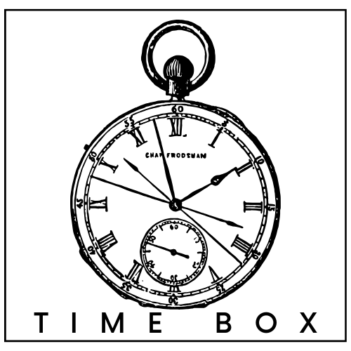

# Box Time

Discover a better way to manage your time and tasks with Box Time. Our three-step process empowers you to Brain Dump all your thoughts and to-dos, then Choose Top Priorities, and finally, easily Schedule your day. Create time-based PDFs to stay organized and in control. Streamline your daily routine, boost productivity, and make the most of your time with Box Time. Try it today!

## Demo

Insert gif or link to demo

## Tech Stack

**Client:** Flutter, Provider, 

## Features

- Light/dark mode toggle
- Live previews
- Fullscreen mode
- Cross platform

## Screenshots

## Authors

- [@majdideveloper](https://github.com/majdideveloper)

