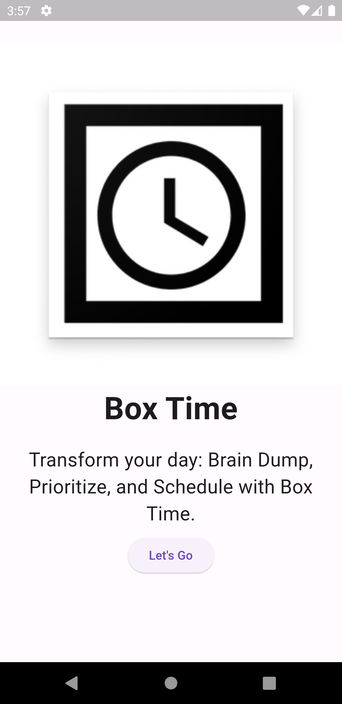

    

# Box Time
    

Discover a better way to manage your time and tasks with Box Time. Our three-step process empowers you to Brain Dump all your thoughts and to-dos, then Choose Top Priorities, and finally, easily Schedule your day. Create time-based PDFs to stay organized and in control. Streamline your daily routine, boost productivity, and make the most of your time with Box Time. Try it today!

## Demo

link Video demo Live: https://youtu.be/T_jIXrGWooQ

## Tech Stack

**Client:** Flutter, Provider, 

## Screenshots

## Authors

- [@majdideveloper](https://github.com/majdideveloper)

